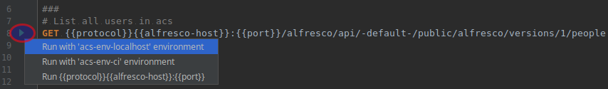

# intellij-http-rest-client-for-alfresco-rest-api
> Provides REST Snippets in Jetbrains's HTTP Client format to access the official Alfresco's REST API 

This project will cover the Alfresco Public API for Alfresco Content Services
(see: [Alfresco API Explorer](https://api-explorer.alfresco.com/api-explorer/))
with the build in HTTP Rest Client from Jetbrains. 
Similar to tools like Postman, you can use this project to enhance your Alfresco development.

## Requirements
* JetBrains IDE of your choice with the build in HTTP REST Client<br/>
  [https://www.jetbrains.com/help/idea/http-client-in-product-code-editor.html](https://www.jetbrains.com/help/idea/http-client-in-product-code-editor.html)
  
## How do I use this project?
You can either use this project as a template or just copy specific files to your current Alfresco SDK project.
For example you can copy the [acs_rest_api](acs_rest_api) folder into the /src/test folder of your Alfresco all-in-one project and modify them to test your custom API.

Or you may just clone this project and use it in addition to your current development workflow.


### Configuration

#### Environment Config
All configuration is stored in the [rest-client.env.json](/acs_rest_api/rest-client.env.json) file.<br/>
Example:<br/>
```
"acs-env-localhost": {
    "protocol": "http://",
    "alfresco-host": "localhost",
    "port": 8080,
    "auth-admin": "Basic YWRtaW46YWRtaW4=",
    "auth-manager": "Basic bWphY2tzb246bWlrZTEyMzQ=",
    "auth-collaborator": "Basic YWJlZWNoZXI6YWxpY2UxMjM0",
    "alfresco-site-id": "swsdp",
    "test-site-id": "testy",
    "audit-application-id" : "alfresco-access"
  },
```
You can specify as many Alfresco Environments as you wish to access via these REST API calls.
Click on the play icon next to the rest call to choose the Alfresco environment where the rest call should be executed:



You can specify additional variables in the settings ([rest-client.env.json](/acs_rest_api/rest-client.env.json))
and use them in your REST call by using ```{{variablename}}``` 

#### TestData

In the [testdata](testdata) folder are some example files from the [Sample: Web Site Design Project](http://localhost:8080/share/page/site/swsdp/) which are used to demonstrate upload and node creation behavior.


## Contribution

This is an Alfresco project for the community. If you work with this project please contribute & share your enhancements.
Feel free to fork this project and send me pull requests. The goal is to one day cover the full feature list of the Alfresco API within the Jetbrains IDE.

### Additional Links

* [Alfresco REST API official Documentation](http://docs.alfresco.com/6.0/pra/1/topics/pra-welcome.html)
* [Alfresco REST API Community page](https://community.alfresco.com/docs/DOC-6425-rest-api)
* [Alfresco REST API Community collection](https://community.alfresco.com/docs/DOC-6532-alfresco-52-rest-apis)

<br/>

## Authors

* **[Alexander Seitz](https://github.com/aitseitz)** - *initial work* 

## License

This project is licensed under the MIT License - see the [LICENSE](LICENSE) file for details

<br/>
